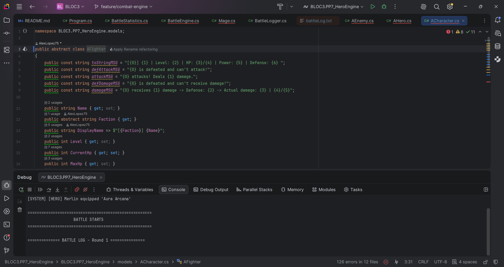
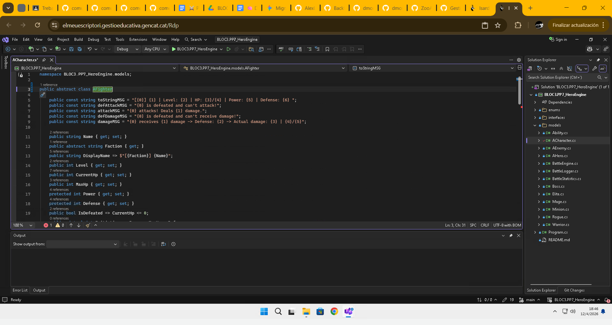
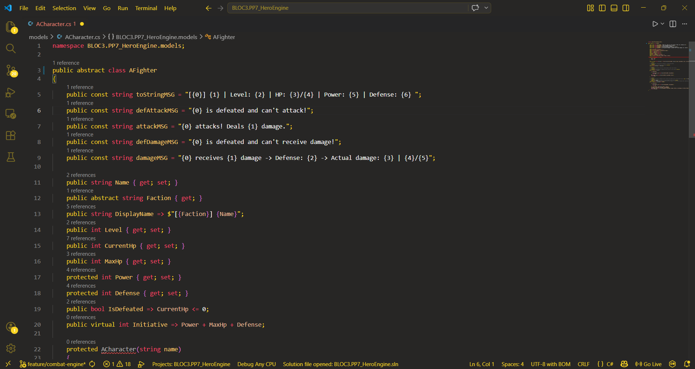
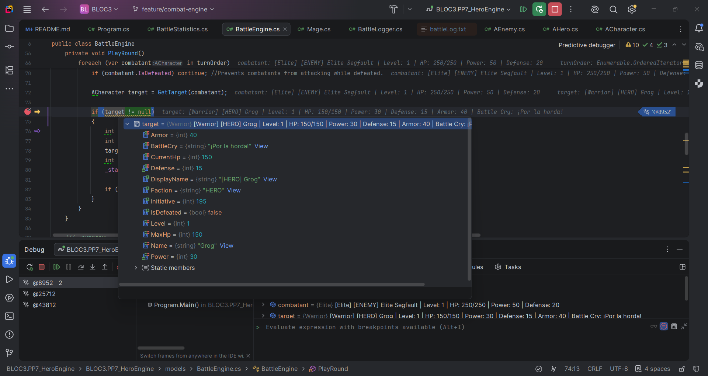
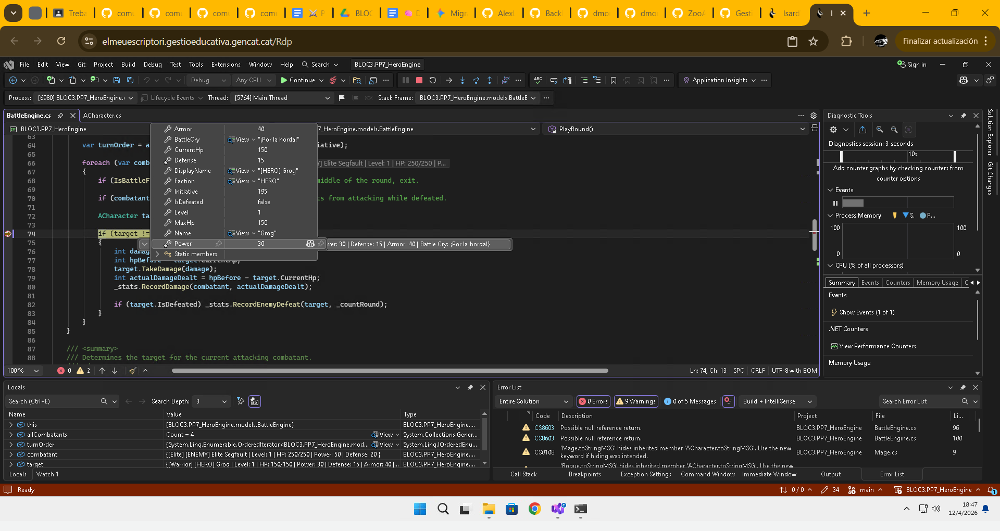
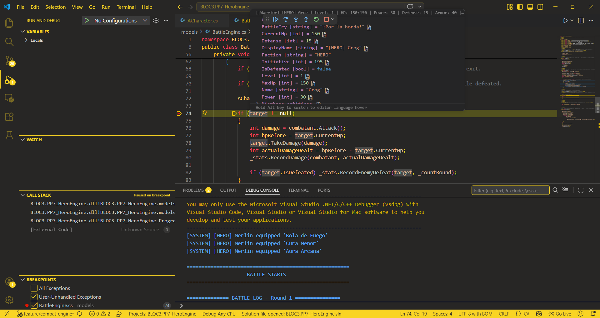
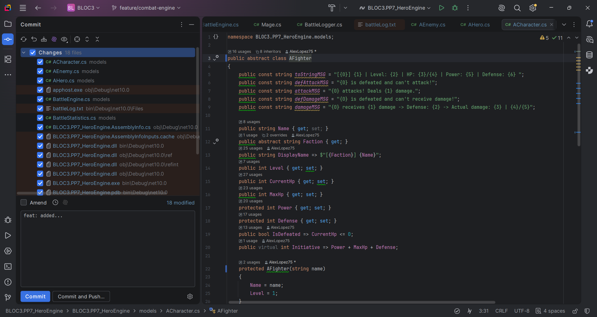
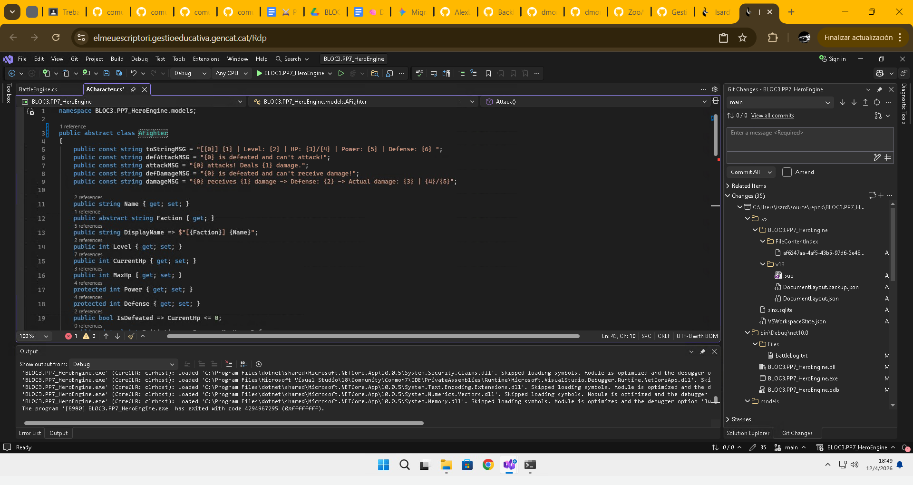
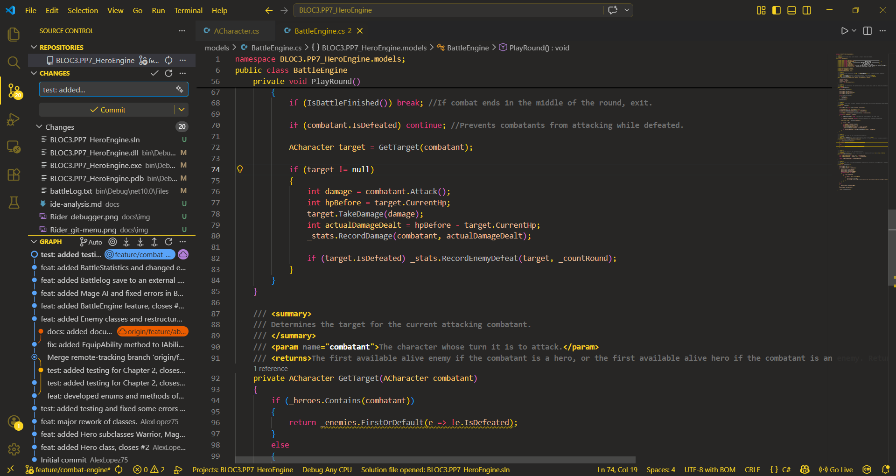

# Chapter 4. La Forja de les Eines — Anàlisi d'IDEs

## 1. Context i Introducció
Breu introducció explicant que en aquest document s'analitzaran tres entorns de desenvolupament (Rider, VS 2026 i VS Code) utilitzats durant la creació del projecte HeroEngine.

## 2. Taula Comparativa Resum
| Criteri | JetBrains Rider | VS Comunity 2026 | VS Code + Dev Kit |
| :--- | :--- | :--- | :--- |
| **Llicència** | De pagament (Excepte per estudiants) | Gratuït (Community) | Gratuït |
| **Sistemes Operatius** | Windows, macOS, Linux | Windows | Windows, macOS, Linux |
| **Rendiment** | Molt ràpid i fluit | Una mica lent, pesat a l'inici | Lleuger però requereix plugins |
| **Depurador (Debugger)**| Excel·lent i intuïtiu | Molt potent, estàndard | Funcional però bàsic |

## 3. Anàlisi Detallat per Criteris

### 3.1. Edició de codi i Refactoring
Rider: Té una interfaç d'usuari intuitiva i senzilla, permet una ràpida edició del codi amb una bona navegació entre classes i a més, té una funció de canviar el nom d'una variable i aplicar els canvis a totes les instancies d'aquesta al projecte. L'autocmpletar és bastant fiable, però, millorable. Els errors no donen molta informació de possibles solucions.  

  

VS Comunity 2026: Té una interfaç d'usuari una mica menys intuitiva que Rider, permet una rapida edició del codi, però, la seva capacitat de Refactoritzar les variables és més limitada que Rider. Té una bona navegació de classes, però, l'autocompletar deixa molt que desitjar. Els erros donen informació i codis d'error per trobar solucions.  

  

Visual Studio + Dev Kit: Té una interfaç d'usuari standard i senzilla, permet editar el codi, però, no té la funcionalitat de Rider ni VS Comunity. Permet una bona navegació entre classes i l'autocompletar és poc fiable. Els errors donen informació similar a la de VS Comunity 2026.  

  

### 3.2. Depurador (Debugger) i Inspecció en temps d'execució

Rider: Permet fer una exhaustiva depuració del codi, els punts de ruptura, inspecció d'objectes en temps d'execució, visualització, watches i expresions són correctes per l'ús i tenen molts detalls que permeten debuggar de forma profunda. Rider a més, detalla al costat de cada linia el resultat de l'execució.  

  

VS Comunity 2026: Permet fer una correcta depuració del codi, els punts de ruptura, inspecció d'objectes en temps d'execució, visualització, watches i expresions són correctes per l'ús. Els watches tenen una bona visibilitat, però, no hi ha tant de detall a l'hora de debuggar.

 

Visual Studio + Dev Kit: Permet fer una depuració duperficial del codi, els punts de ruptura, inspecció d'objectes en temps d'execució, visualització, watches i expresions són simples. No és el millor IDE per debuggar però és funcional per treballs més senzills.

 

### 3.3. Generació d'executables
Rider: És molt similar a VS, més flexible amb el Run/Debug Configurations, amb configuracions Release més netes. Molt bona i ràpida gestió de NuGet i detecta automaticament si hi falten paquets. Utilitza el perfils de publicació de .NET de forma nativa per publicar el .exe.

VS Comunity 2026: Permet definir comportaments especifics entre Release i Debug, és molt visual i dificil de trencar. Utilitza NuGet Package Manager UI, ideal per veure conflictes de versions entre diferents projectes de la solució. Té el Publish Wizard que guia a l'usuari en la creació i publicació del .exe i a meés, permet retallar codi sense utilitzar entre d'altres eines. 

VS Code + Dev Kit: Potent però poc intuitiu i manual a l'hora de generar executables. Per gestionar dependències depèn del terminal o plugins. La publicació és totalment dependent del terminal.

### 3.4. Integració amb Control de Versions (Git)
Rider: Té una bona gestió de branques, UI més complexa i potent, permet solucionar conflictes sense sortir de l'IDE de forma més detallada i tècnica.  

  

VS Comunity 2026: Té una gestió de branques més simplificada i intuitiva, més incisiva amb la IA. Resolució de conflictes in app menys complexe que Rider.  

  

VS Code + Dev Kit: Permet gestionar les branques de forma molt detallada, la UI és molt simple i senzilla. Permet gestionar individualment els coflictes per decidir els canvis.  

  

### 3.5. Extensibilitat, Ecosistema i Rendiment
Rider: Té plugins integrats i optimitzats, poc dependent de plugins.

VS Comunity 2026: Té l'ecosistema de Microsoft i té plugins que són eines potents amb IA de copilot.

VS Code + Dev Kit: És un IDE que necessita de molts plugins per poder utilitzar-se en desenvolupament de C#. 

### 3.6. Rendiment
Rider: Rendiment de memoria pesat (alt consum), velocitat lenta en arrencar però ràpid a la resta. Molt estable i capaç de refactoritzar i cercar molt codi rapidament en grans projectes.

VS Comunity 2026: Rendiment de memoria normal (consum intermig), velocitat més ràpida que Rider. Estabilitat sòlida, refactorització fiable i cerca molt completa en grans projectes.

VS Code + Dev Kit: Rendiment de memoria lleuger (consum baix), veloditat ràpida en arrencar. Pot ser inestable en grans projectes, la refactorització és basica i la cerca es ràpida, però, poc detallada.

## 4. Conclusió i Recomanació Justificada
En conclusió, el motor ideal per poder desenvolupar el projecte PP7.HeroEngine: OOP Quest seria VS Comunity 2026 perquè no necessita configuració prèvia per poder executar-lo i té un rendiment estable. 
Una altra rao seria que el debugger és molt intuitiu i visual, a més d'estable.
Per úlitm, la gestió de dependències és molt visual i en un futur podria estalviar problemes a l'hora de solucionar compatibilitats.